# Architecture

## System Overview

The eBPF implant follows a **four-tier layered architecture** for telemetry collection, anti-forensics, and intelligence integration:

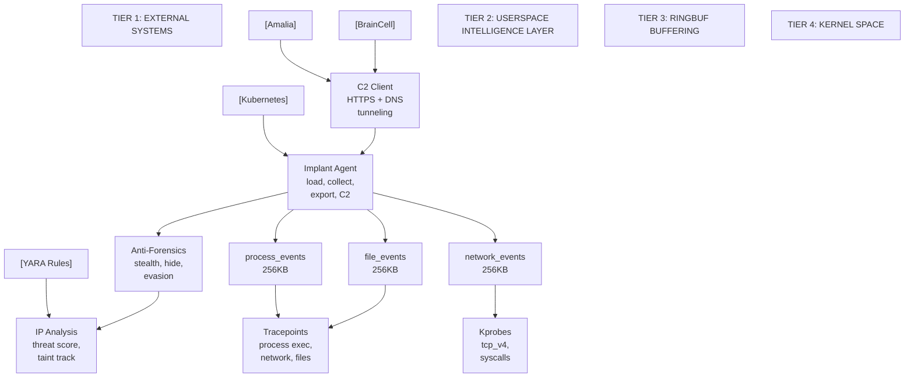

## Component Architecture

### Tier 4: Kernel Space (sensor.bpf.c - ~300 lines)

**eBPF Hooks:**
- **Tracepoints** (stable kernel events):
  - tp/sched/sched_process_exec - Process execution events
  - tp/sched/sched_process_fork - Process forking
  - tp/syscalls/sys_enter_openat - File open operations
  - tp/syscalls/sys_enter_read - File read syscalls
  - tp/syscalls/sys_enter_write - File write syscalls

- **Kprobes** (dynamic function hooks):
  - tcp_v4_connect() - Outbound TCP connections
  - tcp_v4_syn_recv_sock() - Inbound TCP connections

**Event Types (Ring Buffers):**
- process_event: 844 bytes (timestamp, pid, ppid, uid, gid, comm, filename, argv)
- network_event: 40 bytes (timestamp, pid, sport, dport, saddr, daddr, protocol)
- file_event: 296 bytes (timestamp, pid, path, flags, mode, operation type)

**Design Decisions:**
- Ring buffers over perf buffers (better performance for high-volume events)
- Per-event-type buffers to prevent cross-type interference
- Minimal data collection (filter at kernel level to reduce ringbuf overflow)
- Tracepoints preferred over kprobes (stable ABI, predictable performance)

### Tier 3: Ring Buffer Interface (kernel -> userspace IPC)

**Data Transfer Protocol:**
- 256KB ring buffer per event type
- Lock-free design (producer: kernel, consumer: userspace)
- Automatic event loss tracking (configurable threshold)
- Poll interval: ~100ms (tunable)

### Tier 2: Userspace Intelligence Layer (userspace/src/)

**1. Implant Agent (implant_agent.py - ~550 lines)**
- `ConfigManager` - JSON-based runtime configuration
- `EBPFImplantAgent` class:
  - `compile_bpf()` - clang -O2 -target bpf compilation
  - `load_bpf()` - BCC raw_cb bytecode loading
  - `start_collection()` - Main polling loop with per-type callbacks
  - `export_telemetry()` - JSON export to /tmp/ebpf-telemetry/
  - `export_to_amalia()` - HTTP POST to Amalia API

**Configuration (config.json):**
- implant.id: Unique identifier
- collection: Toggle per-event-type collection
- output: Export path and format
- amalia: API endpoint and auth
- performance: Ringbuffer size, poll interval, max loss %
- debugging: Verbose mode, logging level

**2. Anti-Forensics Layer (anti_forensics.py - ~400 lines)**
Strategic stealth mechanisms:
- `AuditSuppressor` - Detect/suppress auditd bpf() syscall logging
- `ProcessHider` - Double-fork, ptrace evasion, sysfs obfuscation
- `MemoryObfuscator` - Fernet encryption of events in memory
- `ArtifactCleaner` - Cleanup /tmp/*, bash_history, journalctl
- `KernelHiding` - Rename bpf programs, obfuscate map names
- `DetectionEvader` - Detect Falco/Sysdig/osquery, adapt strategy
- `StealthyImplantBootstrap` - Orchestrate all stealth layers

**3. C2 Communication (c2_client.py - ~500 lines)**
Multi-channel encrypted exfiltration:
- `CertificatePinningAdapter` - HTTPS with SHA-256 cert validation
- `EncryptedPayload` - Fernet encryption/decryption
- `SecureHTTPSClient` - HTTPS with obfuscation and decoy requests
- `DNSTunnelingClient` - DNS TXT record exfiltration (fallback)
- `AdaptiveRateLimiter` - Jitter-based intervals, burst batching
- `C2ClientOrchestrator` - Background thread, command processing

**4. Threat Detection & Analysis Pipeline (optional but recommended):**

The implant includes a comprehensive dual-method threat detection system combining behavioral and signature analysis:

**4a. IP Analysis Module (ip_analysis.py - ~400 lines)**
Behavioral threat profiling for each observed IP address:
- `IPAnalyzer` class - Builds per-IP profiles from network telemetry
- `IPProfile` - Tracks connection patterns, protocols, ports, processes, DNS activity
- `IPThreatIntelligence` - Calculates threat scores (0-100) based on behavioral indicators
  - Suspicious port detection (C2 ports: 4444, 8888, 9999, etc)
  - Connection volume analysis (high volume from single process)
  - DNS tunneling detection (>100 queries + >10KB bytes)
  - Data exfiltration detection (>1MB to public IP)
  - Port diversity scoring (>50 unique remote ports)
- Output: IP profiles with threat scores, behavioral analysis reports

**Configuration:**
```json
{
  "ip_analysis": {
    "enabled": true,
    "threat_scoring": true,
    "min_threat_score_report": 20.0,
    "export_summary": true
  }
}
```

**4b. YARA Signature Detection (yara_detection.py - ~500 lines)**
Pattern-based threat matching against known attack signatures:
- `YARADetector` class - Scans IP profiles against threat patterns
- Six threat categories with 25+ patterns:
  1. **C2 Communication** - Known botnet ports, high-volume beacons
  2. **DNS Tunneling** - Data-over-DNS exfiltration patterns
  3. **Data Exfiltration** - Large outbound transfers, SFTP/FTP flows
  4. **Lateral Movement** - Port scanning, RDP sweeps, SSH brute force
  5. **Credential Access** - SMB, LDAP, Kerberos activity
  6. **Persistence** - DNS hijacking, scheduled task patterns
- Confidence scoring per match (0.5-0.95)
- Severity levels: Critical, High, Medium, Low
- Output: YARA matches with rules, confidence, metadata

**Configuration:**
```json
{
  "yara_analysis": {
    "enabled": true,
    "scan_profiles": true,
    "min_confidence": 0.5,
    "threat_categories": [
      "c2_beacon",
      "dns_tunneling",
      "data_exfiltration",
      "lateral_movement",
      "credential_access",
      "persistence"
    ]
  }
}
```

**4c. External YARA Rules Management (yara_rules_manager.py - ~300 lines)**
Load threat detection rules from multiple centralized sources:
- `YARARulesManager` class - Rule loader with fallback strategy
- Supports four rule sources:
  1. **Embedded** - Built-in hardcoded rules (default, no internet required)
  2. **Local File** - Custom rules from JSON file (manual updates, testing)
  3. **Git Repository** - Version-controlled rules from GitHub (team collaboration)
  4. **BrainCell API** - Centralized threat intelligence from BrainCell (real-time updates)
- Automatic fallback to embedded rules if loading fails
- Caching of loaded rules in memory for performance

**Configuration:**
```json
{
  "yara_analysis": {
    "rules": {
      "source": "embedded|file|git|braincell",
      "file": "/path/to/yara-rules.json",
      "git_url": "https://raw.../yara-rules.json",
      "braincell_url": "http://braincell:8000",
      "braincell_token": "api-token-here"
    }
  }
}
```

**4d. BrainCell Integration (braincell_websocket.py - ~350 lines)**
Real-time streaming of network telemetry to BrainCell persistent memory:
- `BrainCellClient` class - WebSocket/HTTP client for async event streaming
- Batch event ingestion (configurable batch size, flush interval)
- Automatic threat tag generation (tcp/udp, inbound/outbound, port numbers, suspicious-port, unusual-egress, etc.)
- Event deduplication and loss handling
- Retry logic with exponential backoff (configurable max retries)
- Rich metadata export to BrainCell Notes cell:
  - Event timestamps, process info (PID, UID, command)
  - Network addresses and protocols
  - Connection metadata (TCP states, bytes, retransmits)
  - DNS detection flags

**Configuration:**
```json
{
  "braincell": {
    "enabled": false,
    "url": "http://braincell.local:8000",
    "api_token": "sk-your-token-here",
    "batch_size": 50,
    "flush_interval_sec": 10,
    "max_retries": 3
  }
}
```

**4e. Correlated Threat Detection**
Combines behavioral and signature analysis for highest confidence:
```
Behavioral Analysis (IP Analysis)    Signature Detection (YARA)
    IP threat score calculated       Rules matched against IP profile
    High volume, suspicious ports    Known malware patterns detected
              |                                    |
              +------------+-----+-------+--------+
                           |     |       |
                  CORRELATED THREAT DETECTION
                  Both methods agree = CRITICAL
                  Single method = HIGH
                  No match = LOW/CLEAN
```

**Interpretation matrix:**
- **Both methods match**: Highest confidence (CRITICAL) - investigate immediately
- **Behavioral only**: Possible zero-day (HIGH) - monitor closely
- **Signature only**: Known threat (HIGH) - block and investigate
- **Neither method**: Likely legitimate (LOW) - may be false positive

### Tier 1: External Integration

**Integration Points:**
1. **Amalia Platform** - HTTP/S POST to /api/ingest with Bearer token auth
2. **BrainCell** - WebSocket streaming of real-time events
3. **YARA Rules Manager** - Load external YARA rules for pattern matching
4. **Kubernetes** - DaemonSet deployment across all nodes

## Data Flow

### Single Event Journey

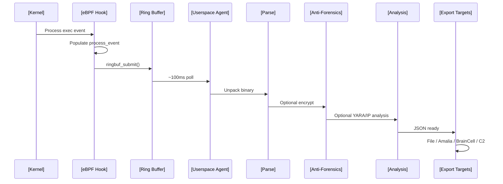

## Threat Detection & Correlation Pipeline

### Behavioral Analysis (IP Analysis)

Each unique IP address observed in network traffic receives behavioral profiling:

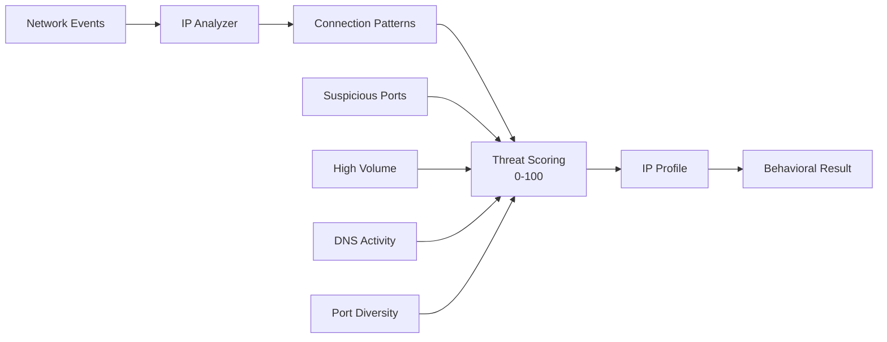

**Threat Score Calculation:**
- Suspicious port usage: +10 per port (4444, 8888, 9999, etc.)
- High connection volume: +15 (>100 from single process)
- DNS tunneling: +20 (>100 queries + >10KB bytes)
- High port diversity: +10 (>50 unique remote ports)
- Connection failures: 0-10 per 10 failures

**Example profiles:**
- Score 45+: Multiple indicators (CRITICAL - likely C2)
- Score 30-44: Strong indicators (HIGH - investigate)
- Score 20-29: Moderate indicators (MEDIUM - monitor)
- Score <20: Minimal indicators (LOW - likely clean)

### Signature Detection (YARA Rules)

Known threat patterns matched against IP profiles:

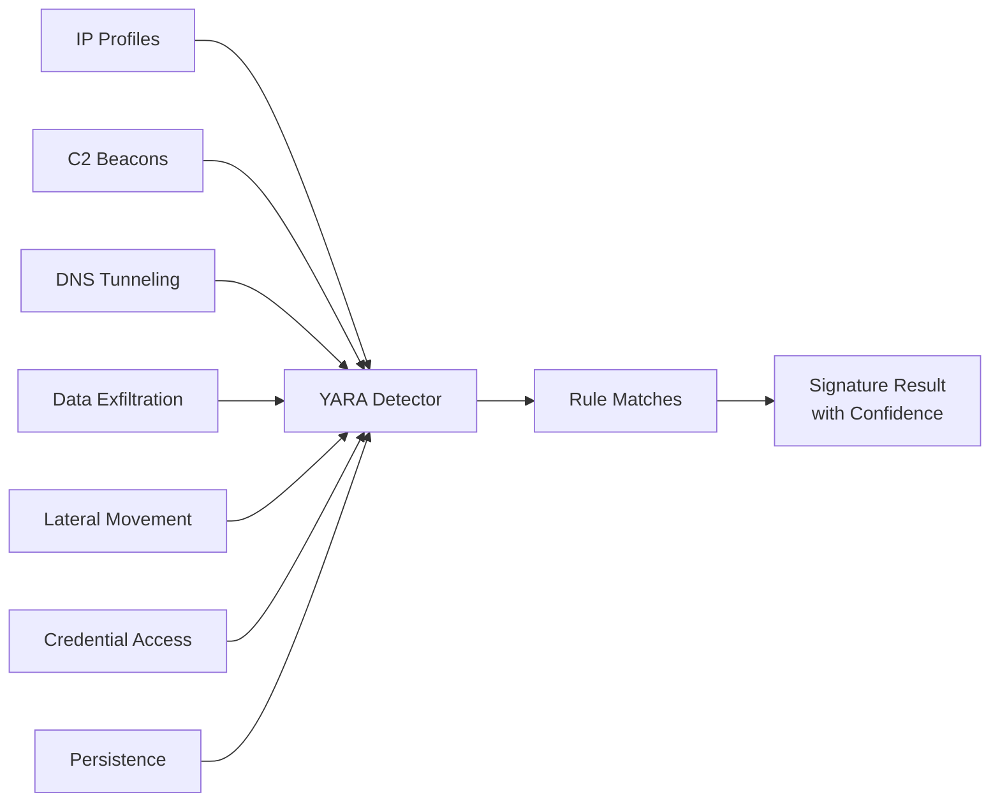

**Rule sources (in priority order):**
1. Git repository (centralized, version-controlled)
2. Local file (testing, custom rules)
3. BrainCell API (real-time intelligence)
4. Embedded rules (always available, reliable fallback)

**Match attributes:**
- Rule name (c2_beacon, dns_tunneling, etc.)
- Confidence score (0.5-0.95)
- Severity (Critical, High, Medium, Low)
- Pattern details and metadata

### Correlation & Final Verdict

Combines behavioral and signature results for final threat assessment:

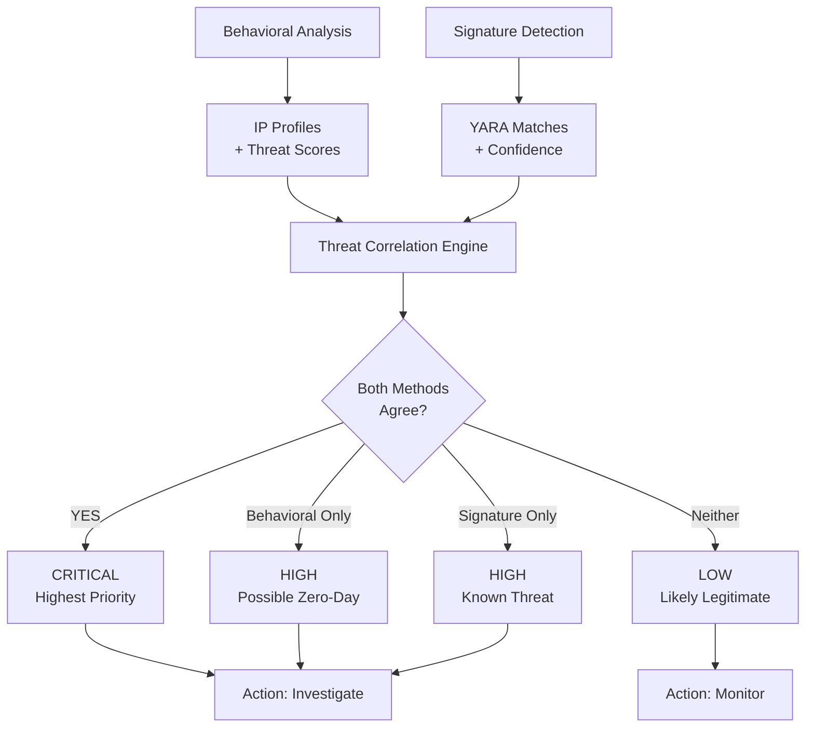

### Threat Hunting Workflows

**Scenario 1: C2 Detection**
1. Behavioral: Detect multiple suspicious ports (4444, 8888), high connection volume
2. Signature: YARA matches c2_beacon rule for these ports
3. Result: CRITICAL - Confirmed C2 communication
4. Action: Block IP, investigate source process

**Scenario 2: DNS Tunneling**
1. Behavioral: 150+ DNS queries + 15KB bytes sent
2. Signature: YARA matches dns_tunneling_high_volume
3. Result: CRITICAL - Data exfiltration via DNS detected
4. Action: Block DNS resolver, investigate process

**Scenario 3: Data Exfiltration**
1. Behavioral: Large outbound transfer (2.5MB) to public IP
2. Signature: YARA matches data_exfiltration pattern
3. Result: HIGH - Confirmed data theft
4. Action: Block outbound, forensic analysis

### Performance of Threat Detection

**Behavioral Analysis (IP Analysis):**
- Per-event overhead: <100µs (parse and update profile)
- Memory per IP: ~2KB (profile structure)
- Threat scoring: <10ms per IP
- Scale: 10K+ unique IPs without degradation

**Signature Detection (YARA):**
- Per-profile scan: <10ms
- Memory for rules: ~100KB (all 25+ patterns)
- Throughput: 100+ profiles/sec
- CPU overhead: <2% additional

**Correlation Engine:**
- Latency: <5ms (compare behavioral + signature)
- Memory: Negligible (in-process)
- Scalability: Linear with IP count

**Total impact with both methods enabled:**
- CPU: ~3-5% (1-3% eBPF + 2% analysis)
- Memory: ~50MB (Python runtime + caches)
- Latency to result: 1-5 seconds (batch window)

### Configuration Examples

**Minimal Setup (Behavioral Only)**
```bash
sudo python3 implant_agent.py \
  --load --collect 60 \
  --ip-analysis \
  --export
```

**Complete Setup (Behavioral + Signature + BrainCell)**
```bash
sudo python3 implant_agent.py \
  --load --collect 60 \
  --ip-analysis \
  --yara-rules \
  --braincell \
  --export
```

**Custom Rules (Git Repository)**
```json
{
  "yara_analysis": {
    "enabled": true,
    "rules": {
      "source": "git",
      "git_url": "https://raw.githubusercontent.com/yourorg/threat-rules/main/yara-rules.json"
    }
  }
}
```

**BrainCell Streaming**
```json
{
  "braincell": {
    "enabled": true,
    "url": "http://braincell.local:8000",
    "api_token": "sk-your-token-here",
    "batch_size": 50
  }
}
```

### Output Files

When threat detection is enabled, the implant generates:

| File | Contents |
|------|----------|
| `telemetry-<ts>.json` | Raw network events (process, network, file) |
| `ip-analysis-<ts>.json` | IP profiles with threat scores |
| `ip-analysis-report-<ts>.txt` | Human-readable behavioral analysis |
| `yara-matches-<ts>.json` | YARA rule matches with confidence |
| `yara-report-<ts>.txt` | Human-readable YARA detection report |

Example ip-analysis output:
```
IP: 93.184.216.34
  Threat Score: 45/100
  Connections: 23 outbound
  Suspicious Ports: [4444, 8888]
  Reason: Multiple C2 ports + high volume
  Status: [ALERT] Possible C2 communication
```

Example yara-matches output:
```
Rule: c2_beacon (High)
  Pattern: port_4444
  Confidence: 85%
  IP: 93.184.216.34
  Metadata: {port: 4444, connections: 12}
```

## Architecture Patterns

### Deployment Patterns

**1. Manual Collection (Ad-hoc)**

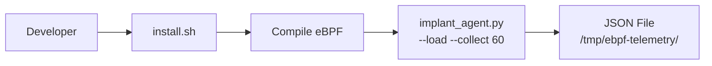

Use case: One-time monitoring of specific scenarios

**2. Persistent Service (Always-on)**

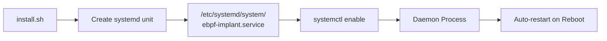

Use case: 24/7 honeypot monitoring

**3. Kubernetes DaemonSet (Enterprise)**

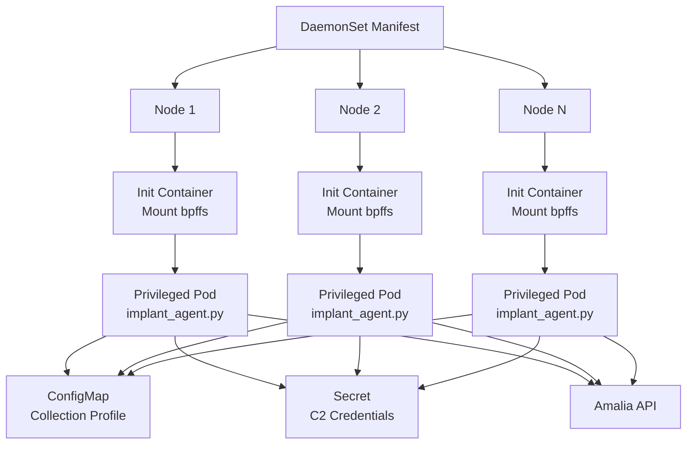

Use case: Multi-node cluster-wide visibility

### Communication Patterns

**Primary Channel: HTTPS**
- Certificate pinning (SHA-256 of leaf cert)
- Adaptive rate limiting (10-100 events/batch)
- Jitter in transmission interval (avoid pattern detection)

**Fallback Channel: DNS Tunneling**
- TXT record exfiltration (1KB per query)
- Chunked telemetry over DNS
- Automatic fallback if HTTPS fails

**Secondary Channels:**
- BrainCell WebSocket for real-time analysis
- File export to /tmp for local processing
- Event queuing in memory if network unavailable

### Security Boundaries

**Kernel -> Userspace:**
- Ring buffers avoid copy_to_user() bottleneck
- Data validation in userspace (untrust kernel data)
- Memory encryption in userspace (Fernet)

**Userspace -> Amalia:**
- TLS/HTTPS only (no plaintext telemetry)
- Certificate pinning prevents MITM
- Bearer token auth in Authorization header
- Event payload encrypted with Fernet

**Anti-Forensics Boundaries:**
- Audit rule suppression (prevent auditd logging)
- Process hiding from /proc and ps output
- Map name obfuscation with UUIDs
- Artifact cleanup (/tmp, bash_history, journalctl)

## Performance Characteristics

**Kernel-Space Overhead:**
- Per-event: ~0.5-1µs (eBPF program execution)
- CPU: ~1% idle, ~3% active collection
- Memory: ~30MB (ringbuf + maps + compiled code)

**Userspace Overhead (Implant Agent):**
- Poll interval: ~100ms (configurable 10-1000ms)
- Per-event processing: ~100µs (parse + optional analysis)
- Memory: ~50-100MB (Python runtime + cache)

**Threat Detection Overhead (when enabled):**
- IP Analysis: <100µs per event (profile update), <10ms per threat score
- YARA Detection: <10ms per IP profile scan, 100+ profiles/sec
- BrainCell Streaming: <1ms per event (queue), batch flush every 10s
- Total threat pipeline: ~2-5% CPU, ~20MB memory

**Network Overhead (Amalia export):**
- Batch transmission: ~1-5 seconds (configurable)
- Payload size: ~50KB per 50-event batch
- Throughput: ~10-100 events/sec sustained

**BrainCell Streaming:**
- Metadata per event: ~200 bytes
- Batch overhead: ~50 bytes (minimal)
- Network per 50 events: ~10KB
- Database growth: ~250MB per 1M events

**Scaling Limits:**
- Single implant: ~50K events/sec (ringbuf capacity)
- Threat detection: Linear with unique IP count (~10K+ without issues)
- Kubernetes DaemonSet: Linear with node count
- Amalia ingestion: Depends on backend capacity
- BrainCell streaming: Depends on API performance

**Typical deployment impact (all features enabled):**
- CPU: 3-5% (eBPF + userspace + threat detection)
- Memory: 100-150MB
- Network: 10-50KB/min (batched, quiet)
- Latency to threat alert: 1-5 seconds (batch window)

## Extensibility Points

**Adding New Event Types:**
1. Define new struct in sensor.bpf.c
2. Create new ringbuf in maps section
3. Add hook handler (tracepoint or kprobe)
4. Add parser in implant_agent.py
5. Register callback in start_collection()

**Adding New Output Targets:**
1. Implement output handler class
2. Add to ConfigManager
3. Call from export pipeline
4. Example: Splunk, Elasticsearch, S3, etc.

**Adding New Analysis:**
1. Create analysis module (e.g., threat_scorer.py)
2. Implement in anti_forensics or separate pipeline
3. Enrich event dict with new fields
4. Export enriched events

## Deployment Topology

### Single Node

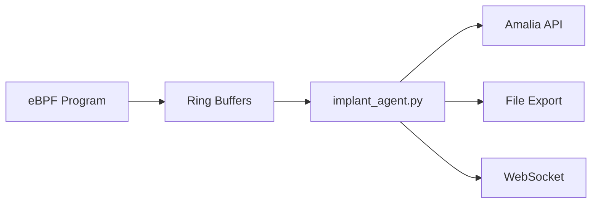

Deployment: `sudo bash build/install.sh`

### Multi-Node Kubernetes

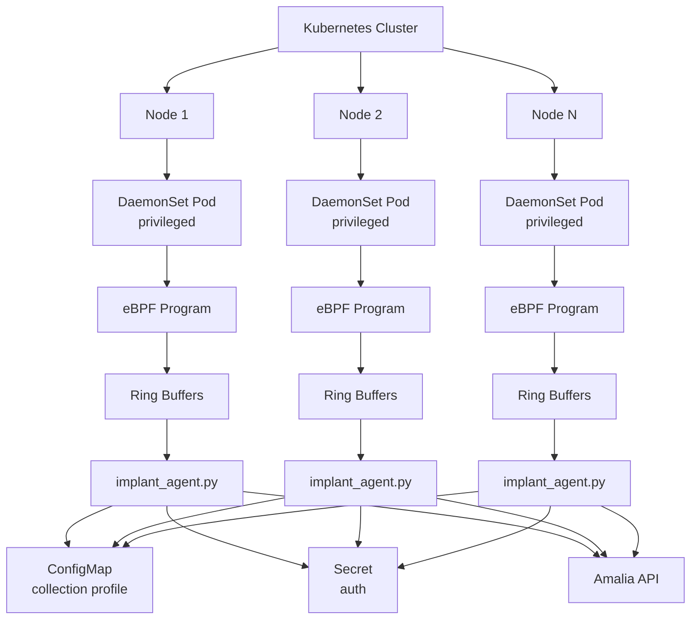

## Threat Detection Module Integration

The threat detection modules form a complete intelligence pipeline:

### Workflow: From Event to Verdict

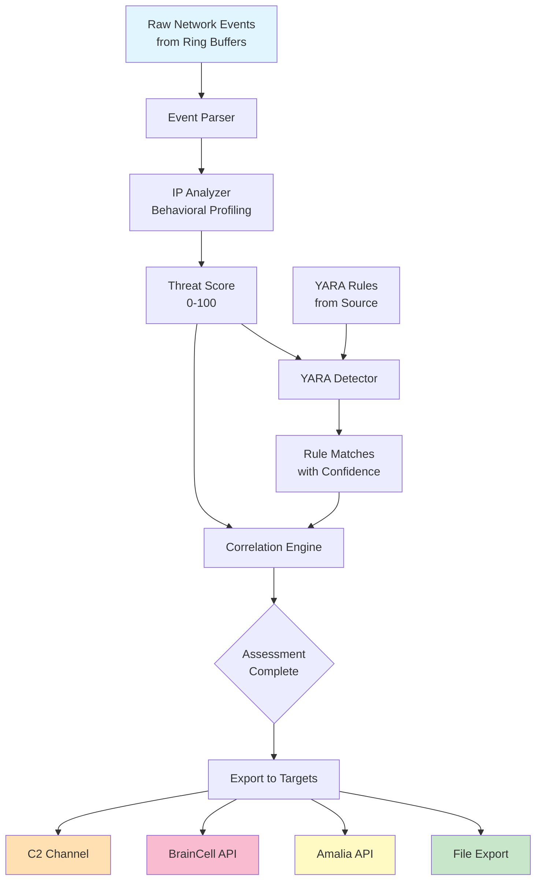

### Module Interactions

**IP Analysis -> YARA Detection:**
- IP profiles provide context for YARA rules
- Profile fields (ports, volume, processes) trigger specific rules
- Threat score influences YARA scanning priority

**YARA Detection -> BrainCell:**
- Detected threats tagged in BrainCell for threat hunting
- Searchable by threat category, severity, confidence
- Enables building organizational threat intelligence database

**BrainCell -> External Rules:**
- BrainCell stores custom threat patterns as rules
- Rules automatically loaded by implants
- Enables centralized threat intelligence management

**Anti-Forensics Layer:**
- Hides threat detection activity from monitoring tools
- Encrypts threat analysis results in memory
- Prevents audit logging of detection process

### Real-World Integration Scenarios

**Scenario A: Autonomous Red Team Sensor**
```
Implant collects -> IP Analysis detects threat -> YARA confirms pattern
-> Exports to Amalia -> Anti-forensics hides activity -> C2 exfiltrates threat
Operational use: Persistent platform visibility during red team exercises
```

**Scenario B: Centralized Threat Intelligence Hub**
```
Multiple implants -> BrainCell ingestion -> Correlated threat detection
-> Custom YARA rules stored in BrainCell -> Rules pushed to all implants
-> Synchronized threat detection across fleet
Operational use: Enterprise-wide security monitoring infrastructure
```

**Scenario C: Incident Response & Forensics**
```
Incident detected -> Implant enables all analysis -> IP profiles exported
-> Historical threat patterns analyzed -> Exfiltration paths reconstructed
-> Timeline of attacker activity built
Operational use: Post-breach forensic investigation
```

## Security Considerations

**Attack Surface:**
- eBPF verifier (potential vulnerability: CVE-2021-3490)
- Kernel BPF helpers (limited API reduces risk)
- Ring buffer access (only root can read)

**Defense Mechanisms:**
- Code doesn't require GPL (uses BPF.h, not GPL-only APIs)
- Runs in restricted BPF context (no arbitrary kernel calls)
- Ring buffer data only readable by originating process
- Anti-forensics layer defeats common detection (Falco, osquery)

**Threat Detection Security:**
- YARA rules loaded from trusted sources only (Git, BrainCell, local file)
- Threat analysis results encrypted in memory (Fernet)
- Threat detection doesn't modify host state (read-only)
- Threat alerts sanitized before export (no sensitive PII)

**Operational Security:**
- C2 uses cert pinning + HTTPS (TLS 1.3 recommended)
- Amalia credentials stored in Kubernetes Secrets
- BrainCell tokens stored securely in config.json
- DNS tunneling provides fallback if network blocked
- Audit suppression prevents evidence trail
- Threat detection activity also suppressed from audit logs

## Configuration & Usage Reference

### Command-Line Flags for Threat Detection

```bash
# Enable IP analysis (behavioral profiling)
--ip-analysis

# Enable YARA signature detection
--yara-rules

# Stream to BrainCell in real-time
--braincell

# Export results to JSON files
--export

# Combinations
--load --collect 60 --ip-analysis --yara-rules --braincell --export
```

### Configuration File Structure

**Minimal (no threat detection):**
```json
{
  "implant": {"id": "ebpf-sensor-01"},
  "collection": {
    "network_events": {"enabled": true}
  }
}
```

**Complete (all threat detection):**
```json
{
  "implant": {"id": "ebpf-sensor-01"},
  "collection": {
    "network_events": {"enabled": true}
  },
  "ip_analysis": {
    "enabled": true,
    "threat_scoring": true,
    "min_threat_score_report": 20.0
  },
  "yara_analysis": {
    "enabled": true,
    "scan_profiles": true,
    "min_confidence": 0.5,
    "rules": {
      "source": "git",
      "git_url": "https://raw.../yara-rules.json",
      "cache_rules": true
    }
  },
  "braincell": {
    "enabled": true,
    "url": "http://braincell:8000",
    "api_token": "sk-token-here",
    "batch_size": 50,
    "flush_interval_sec": 10
  },
  "amalia": {
    "enabled": false,
    "url": "http://amalia:8000"
  },
  "output": {
    "telemetry_dir": "/tmp/ebpf-telemetry"
  }
}
```

### Usage Examples

**Example 1: Minimal - Just collect events**
```bash
sudo python3 implant_agent.py --load --collect 60 --export
# Output: /tmp/ebpf-telemetry/telemetry-*.json (raw events only)
```

**Example 2: Behavioral Analysis**
```bash
sudo python3 implant_agent.py --load --collect 60 --ip-analysis --export
# Output: telemetry.json + ip-analysis-*.json + ip-analysis-report-*.txt
```

**Example 3: Behavioral + Signature Detection**
```bash
sudo python3 implant_agent.py --load --collect 60 --ip-analysis --yara-rules --export
# Output: telemetry.json + ip-analysis + yara-matches + both reports
```

**Example 4: Complete (all features)**
```bash
sudo python3 implant_agent.py \
  --load \
  --collect 3600 \
  --ip-analysis \
  --yara-rules \
  --braincell \
  --export
# Output: Files + streams to BrainCell + exports to disk
```

**Example 5: Continuous monitoring with systemd**
```bash
sudo systemctl enable ebpf-implant
sudo systemctl start ebpf-implant
sudo journalctl -u ebpf-implant -f
# Continuously collects + analyzes + streams to BrainCell
```

### Threat Detection Outputs

When all modules enabled, these files are generated in `/tmp/ebpf-telemetry/`:

| File | When Generated | Contains |
|------|---|---|
| `telemetry-<ts>.json` | Always | All raw network events |
| `ip-analysis-<ts>.json` | With `--ip-analysis` | Per-IP profiles with threat scores |
| `ip-analysis-report-<ts>.txt` | With `--ip-analysis` | Human-readable threat analysis |
| `yara-matches-<ts>.json` | With `--yara-rules` | Matched YARA rules with confidence |
| `yara-report-<ts>.txt` | With `--yara-rules` | Human-readable YARA report |

### Viewing Results

**View threat analysis report:**
```bash
cat /tmp/ebpf-telemetry/ip-analysis-report-*.txt
```

**Query BrainCell for threats:**
```bash
# Find all high-severity threats
curl -H "Authorization: Bearer $TOKEN" \
  "http://braincell:8000/api/notes?tags=suspicious-port"

# Find DNS tunneling attempts
curl -H "Authorization: Bearer $TOKEN" \
  "http://braincell:8000/api/notes?tags=dns-tunneling"
```

**Export for further analysis:**
```bash
# Copy YARA matches to threat intelligence platform
cp /tmp/ebpf-telemetry/yara-matches-*.json ./threats.json

# Load into Splunk, ELK, or other SIEM
curl -X POST http://splunk:8088/services/collector \
  -H "Authorization: Splunk $HEC_TOKEN" \
  -d @threats.json
```

## Security Considerations
